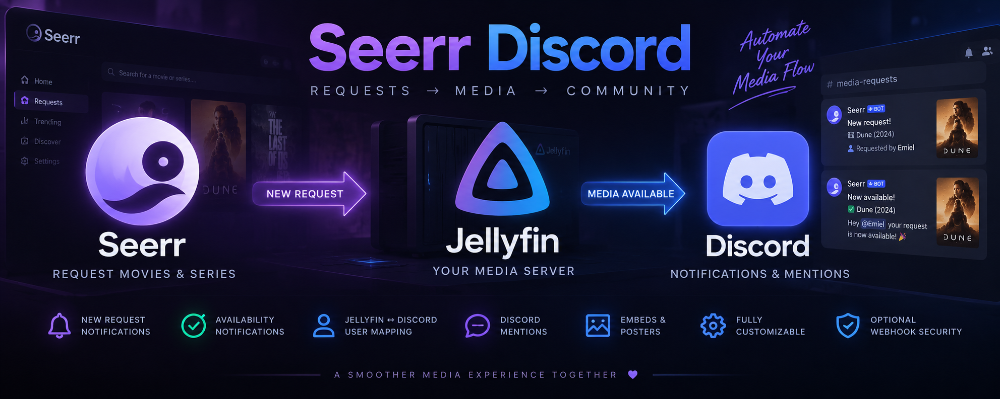

<p align="center">
  
</p>
# Seerr Discord

Seerr Discord is a Jellyfin plugin that connects **Seerr requests with Discord**.

When a Jellyfin user requests a movie or series through Seerr, the plugin can automatically send a notification to Discord. Once the requested media becomes available, the plugin can send another notification and mention the Discord account linked to that Jellyfin user.


## ✨ Features

* 🎬 Send Discord notifications when a new Seerr request is created
* ✅ Send another notification when requested media becomes available
* 👤 Automatically discover Jellyfin users
* 🔗 Map Jellyfin accounts to Discord User IDs
* 🔔 Mention the correct Discord user when their request becomes available
* 🎨 Optional Discord embeds
* 🖼️ Optional media posters
* 📺 Show whether the request is a movie or series
* ✏️ Customizable notification titles, messages and emojis
* 📨 Separate Discord webhooks for incoming and available requests
* 🔐 Optional token protection for the Seerr webhook endpoint
* 🔄 Automatically discover newly created Jellyfin users
* ⚙️ Configure everything directly from the Jellyfin administration dashboard

### Message placeholders

Notification messages can be customized using placeholders:

```text
{user}
{mention}
{discordUserId}
{title}
{mediaType}
{mediaStatus}
{requestId}
{jellyfinUserId}
{jellyfinMediaId}
```

For example:

```text
{user} requested **{title}**.
```

Or for an available request:

```text
{mention} your request **{title}** is now available!
```

---

## 📦 Installation

Seerr Discord can be installed using Jellyfin's custom plugin repository system.

### 1. Add the plugin repository

Open your Jellyfin administration dashboard and navigate to:

**Dashboard → Plugins → Repositories**

Click **Add Repository**.

Use:

**Repository Name**

```text
Seerr Discord
```

**Repository URL**

```text
https://raw.githubusercontent.com/certified-dumbass/Seerr-Webhook/main/manifest.json
```

Save the repository.

### 2. Install Seerr Discord

Navigate to:

**Dashboard → Plugins → Catalog**

Find **Seerr Discord** and install the latest available version.

Restart Jellyfin after installation.

### 3. Configure the plugin

After restarting Jellyfin, open:

**Dashboard → Plugins → My Plugins → Seerr Discord**

From here you can configure:

* Incoming request Discord webhook
* Available request Discord webhook
* Jellyfin ↔ Discord user mappings
* Discord User IDs
* Notification messages
* Emojis
* Discord mentions
* Embeds
* Posters
* Media type display
* Seerr webhook security token

### 4. Connect Seerr

Configure a webhook notification agent in Seerr and point it to:

```text
http://YOUR-JELLYFIN-SERVER:8096/Dreamstreaming/SeerrDiscord/Webhook
```

If your Jellyfin server is available through HTTPS or a reverse proxy, use your normal externally accessible Jellyfin URL instead.

When a webhook token is configured in the plugin, send the same token using either:

```text
Authorization: Bearer YOUR_TOKEN
```

or:

```text
X-Seerr-Token: YOUR_TOKEN
```

> The exact Seerr webhook payload configuration will depend on your Seerr setup. The plugin expects request information including the notification type, requester, Jellyfin User ID, title, media type and request ID.

---

## 🔗 Jellyfin ↔ Discord user mapping

Seerr Discord automatically discovers users registered on the Jellyfin server.

Inside the plugin settings, each Jellyfin account can be linked to a Discord account using its numeric **Discord User ID**.

For example:

```text
Jellyfin user: Emiel
Discord User ID: 123456789012345678
```

When that user's request becomes available, the plugin can generate:

```text
<@123456789012345678> your request is now available!
```

Discord will then mention the linked user.

If no Discord account is mapped, the plugin can optionally send the notification without a mention.

---

## 🔐 Security

The public Seerr webhook receiver can optionally be protected using a secret token.

It is strongly recommended to configure a token if the webhook endpoint is reachable outside your local network.

Do not publish your:

* Discord webhook URLs
* Seerr webhook token
* Jellyfin API keys
* Other private server credentials

---

## 🤖 AI Disclaimer

Parts of this project were developed with the assistance of artificial intelligence.

AI was used as a development tool to assist with code generation, debugging, documentation and implementation ideas. The project is maintained and tested independently, and AI-generated code may have been reviewed, modified or rewritten before release.

As with any community-developed Jellyfin plugin, use it at your own discretion and report any issues you encounter.

---

## 💜 Enjoy!

Thanks for checking out **Seerr Discord**!

Hopefully this plugin makes the whole request flow a little nicer:

**Request in Seerr → notification in Discord → media becomes available → user gets tagged → start watching.**

Enjoy your movies and series! 🍿
